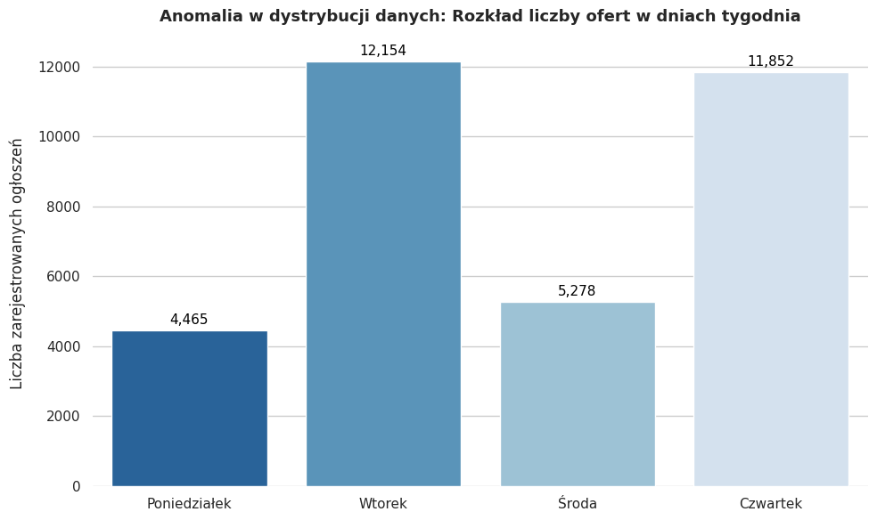

Markdown

# Housing Market Data Analysis (Otodom) – SQL & Python Case Study

[PL] Projekt przedstawia proces czyszczenia, transformacji oraz zaawansowanej analizy biznesowej bazy danych ogłoszeń mieszkaniowych (ponad 33 tysiące rekordów).  
[ENG] This project demonstrates the process of data cleaning, transformation, and advanced business analytics conducted on a housing market dataset containing over 33,000 records.

---

## Wersja Polska

### Wykorzystane Technologie & Techniki SQL
* **Common Table Expressions (CTE):** Organizacja złożonych zapytań w czytelne bloki.
* **Window Functions (`AVG() OVER (PARTITION BY)`, `PERCENT_RANK()`):** Wyliczanie dynamicznych średnich rynkowych oraz segmentacja cenowa (centyle).
* **Data Cleaning & Parsing:** Obsługa uszkodzonych linii pliku CSV (`ignore_errors`), rzutowanie typów (`TIMESTAMP`) oraz unikanie anomalii w strukturze tekstu.
* **Agregacje i Filtrowanie:** `GROUP BY`, `HAVING`, `CASE WHEN`.

### Kluczowe Analizy Biznesowe (Scenariusze)

#### 1. Detekcja Perełek Inwestycyjnych (Algorytm PropTech)
* **Cel:** Automatyczne wyszukiwanie mieszkań niedoszacowanych o co najmniej 20% względem lokalnej średniej rynkowej dla konkretnego miasta i typu budynku.
* *Zastosowanie:* Wykorzystano funkcję okna do obliczenia lokalnego benchmarku cenowego dla każdej kombinacji parametrów i odfiltrowano oferty z największym odchyleniem in minus.

#### 2. Segmentacja Rynku i "Indeks Luksusu"
* **Cel:** Podział rynku na segmenty: Budżetowy, Średni i Premium przy użyciu funkcji `PERCENT_RANK()`.
* *Wniosek:* Analiza pozwala określić, jakie cechy (metraż, liczba pokoi) definiują segment luksusowy w topowych polskich aglomeracjach (Warszawa, Kraków, Poznań).

#### 3. Detekcja Anomalii w Architekturze Danych (Sezonowość)

* **Cel:** Badanie rozkładu publikacji ogłoszeń w dniach tygodnia.
* *Weryfikacja jakości danych:* Zapytanie SQL wykazało nienaturalne skoki wolumenu ofert (skumulowane piki we wtorki i czwartki). Pozwoliło to na sformułowanie wniosku, że badany zbiór danych jest efektem replikacji wsadowej (batch processing) przez skrypt zbierający dane, a nie ciągłego procesu w czasie rzeczywistym.

### Wyzwania z Realnego Świata (Data Engineering)
Podczas realizacji projektu napotkano i rozwiązano krytyczne problemy techniczne:
1.  **Mixed Dtypes Warning:** Kolumna `location` zawierała brudne dane (współrzędne wymieszane z tekstem), co rozwiązano poprzez wymuszenie jawnego typu tekstowego podczas importu.
2.  **CSV Parsing Error (Line 33751):** Uszkodzony wiersz z Poznania (niedomknięte cudzysłowy w opisie oferty) powodował załamanie transakcji. Problem rozwiązano poprzez rekonfigurację parsera DuckDB za pomocą parametrów `auto_detect=true` oraz `ignore_errors=true`.

---

## English Version

### Tech Stack & Advanced SQL Techniques
* **Common Table Expressions (CTEs):** Structuring complex queries into highly readable, modular code blocks.
* **Window Functions (`AVG() OVER (PARTITION BY)`, `PERCENT_RANK()`):** Computing dynamic market benchmarks and percentile-based price segmentation.
* **Data Quality Engineering & Parsing:** Handling corrupted CSV entries (`ignore_errors`), safe data casting (`TIMESTAMP`), and neutralizing structural text anomalies.
* **Aggregations & Conditional Logic:** `GROUP BY`, `HAVING`, `CASE WHEN`.

### Key Business Insights & Scenarios

#### 1. Investment Opportunity Detection (PropTech Algorithm)
* **Objective:** Automatically identify undervalued properties priced at least 20% below the local market average for a specific city and building type combination.
* *Implementation:* Utilized window functions to calculate localized pricing benchmarks, filtering out listings with the most significant negative deviation.

#### 2. Market Segmentation & "Luxury Index"
* **Objective:** Categorize the housing market into Budget, Medium, and Premium/Luxury segments dynamically using the `PERCENT_RANK()` function.
* *Insight:* The analysis isolates and defines the exact characteristics (e.g., average square footage, room counts) that constitute the luxury tier across top Polish metropolitan areas (Warsaw, Kraków, Poznań).

#### 3. Data Architecture Anomaly Detection (Seasonality)

* **Objective:** Investigate the distribution of new property listings across different days of the week.
* *Data Quality Discovery:* The SQL query exposed highly unnatural spikes in volume (concentrated batches on Tuesdays and Thursdays). This led to a crucial engineering conclusion: the dataset represents a periodic batch-processing snapshot (web scraping intervals) rather than a real-time, continuous data stream.

### Real-World Data Engineering Challenges
During development, critical data anomalies were identified and resolved:
1.  **Mixed Dtypes Warning:** The `location` column contained dirty data (geographic coordinates mixed with text). This was fixed by enforcing a strict text schema during the import phase.
2.  **CSV Parsing Error (Line 33751):** A corrupted row from a Poznań listing (unclosed quotation marks in the description text) caused transaction aborts. The parser was hardened by configuring DuckDB with `auto_detect=true` and `ignore_errors=true` to seamlessly skip malformed rows.
